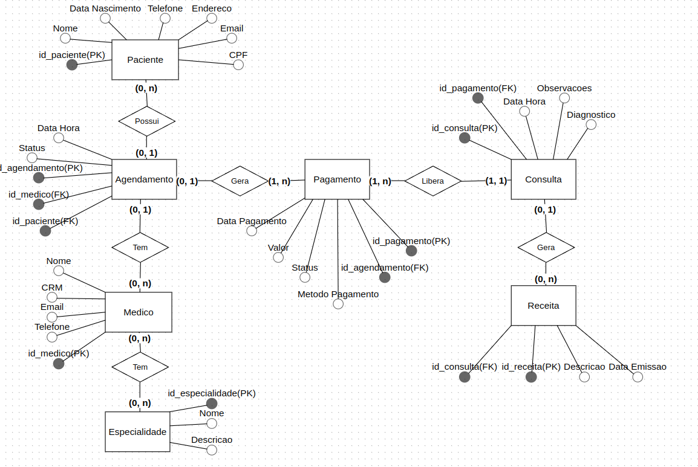
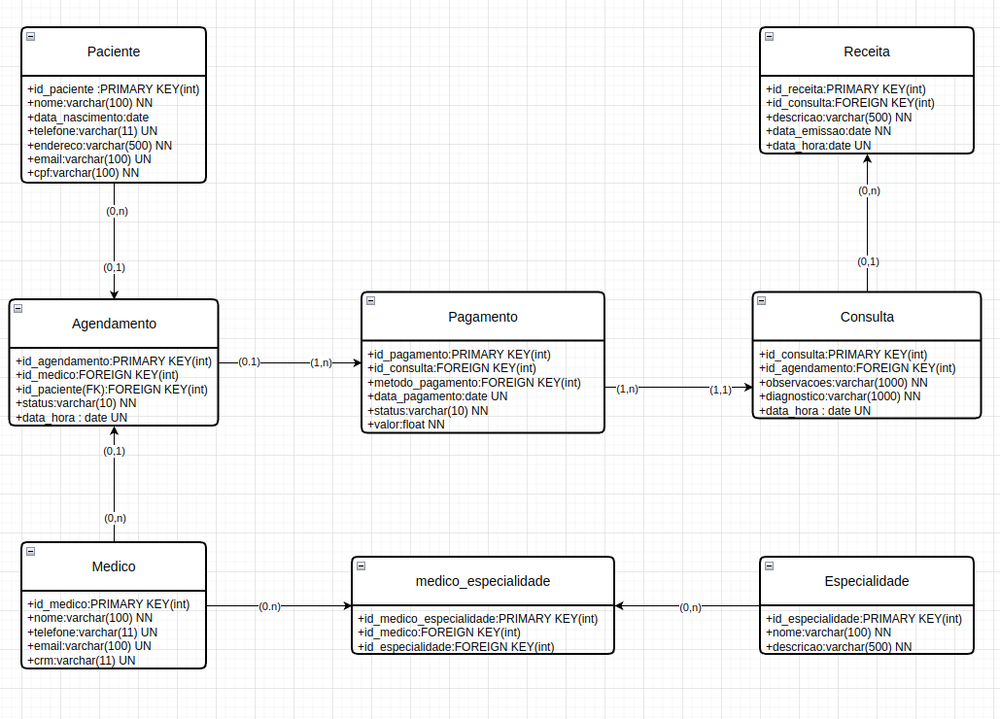

# 🏥 Banco de Dados - Clínica Médica

Um sistema completo de modelagem para controle de **pacientes**, **agendamentos**, **consultas**, **pagamentos**, **receitas**, **médicos** e suas **especialidades**.

> 📊 Este projeto apresenta a **modelagem conceitual**, **modelagem lógica** e **modelagem física** de um sistema de clínica médica, seguindo boas práticas de banco de dados relacional.

---

## 📌 Funcionalidades Modeladas

- 👤 **Cadastro de Pacientes**  
- 🩺 **Cadastro de Médicos e Especialidades**  
- 📅 **Agendamento de Consultas**  
- 💳 **Pagamentos vinculados ao agendamento**  
- 📝 **Consultas com Diagnóstico e Observações**  
- 💊 **Geração de Receitas Médicas após a Consulta**

---

## 🔗 Relacionamentos Principais

| Entidade       | Relacionamento                            | Detalhe                                                                 |
|----------------|--------------------------------------------|-------------------------------------------------------------------------|
| `Paciente`     | possui → `Agendamento`                     | Um paciente pode ter vários agendamentos                              |
| `Médico`       | tem → `Especialidade`                      | Um médico pode ter várias especialidades                              |
| `Agendamento`  | gera → `Pagamento`                         | Um agendamento pode gerar múltiplos pagamentos                        |
| `Pagamento`    | libera → `Consulta`                        | Uma consulta só ocorre após o pagamento ser realizado                 |
| `Consulta`     | gera → `Receita`                           | Uma consulta pode gerar nenhuma ou várias receitas                    |

---

## 🧱 Estrutura da Modelagem

### 📘 Modelagem Conceitual

### 🧾 Modelagem Lógica

